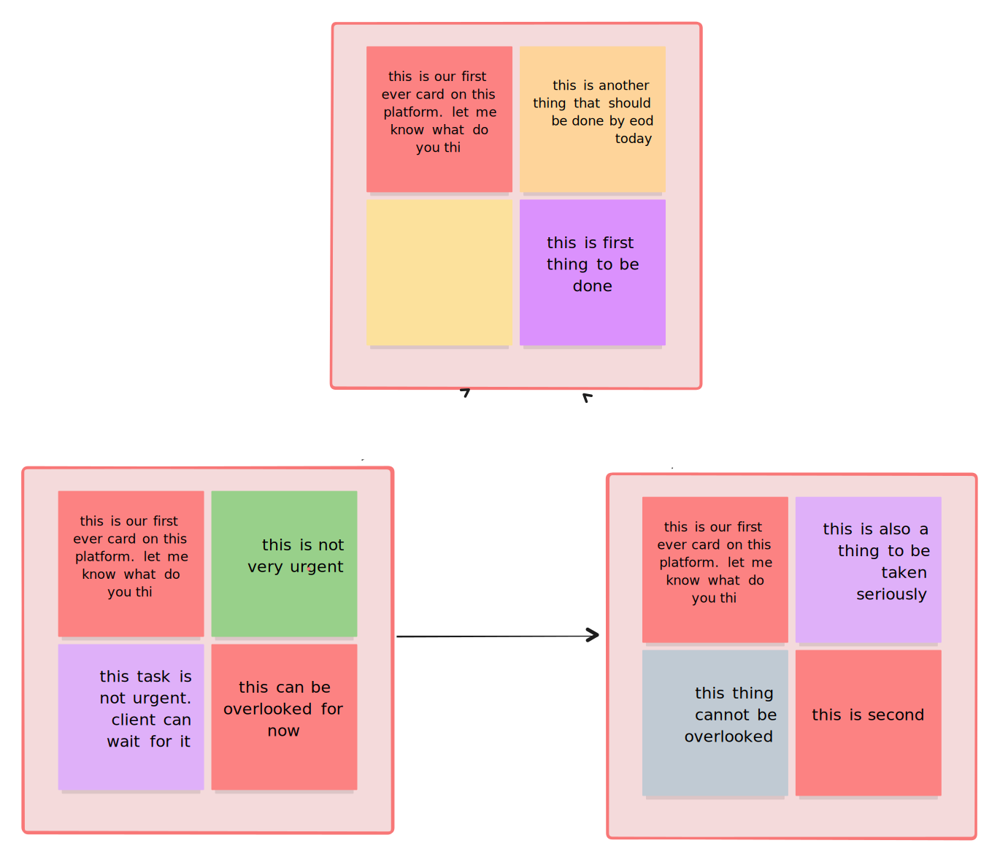

# Synapse

Synapse is a collaborative tool designed to enhance organizational efficiency by managing boards, tasks, and real-time collaboration.

## Features

- User management and organizational roles
- Create and manage boards
- Add, assign, and track tasks
- Mark boards as favorites for quick access

## Screenshots

### Dashboard


### Boards


### Tasks



## Installation

1. Clone the repository:

   ```bash
   git clone https://github.com/your-username/synapse.git
   cd synapse
   ```

2. Install dependencies:

   ```bash
   npm install
   ```

3. Set up environment variables in a `.env` file:

   ```env
   DATABASE_URL=your-database-url
   PORT=your-port
   ```

4. Run database migrations:

   ```bash
   npm run migrate
   ```

5. Start the application:
   ```bash
   npm start
   ```


